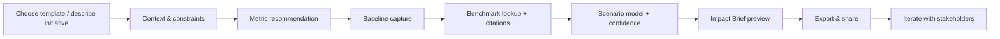

# PRD — Impact (MVP)

## 0. Document control

- **Product name:** Impact
- **Theme:** Productivity Enhancement (TRAE SOLO Hackathon)
- **PRD version:** v1.0
- **Owner:** (you)
- **Last updated:** 2026-05-30
- **Target release:** Hackathon MVP

## 1. Summary (what we’re building)

Impact is an assistant-driven workflow that helps cross-functional teams (PM, Design, Eng, BizOps) **estimate the business impact** of initiatives—especially initiatives that are hard to justify with direct revenue (e.g., tech debt, UX revamps, accessibility, reliability).

The MVP’s main USP is **metric recommendation + estimation grounded in industry benchmark analysis**, with **transparent assumptions** (no black-box “AI says ROI = X”).

### 1.1 Core artifact

**Impact Brief**: a one-page, exportable decision memo that includes:

- What is proposed and why (context + user problem)
- Recommended metrics (leading + lagging)
- Baseline values (observed inputs)
- Benchmarks + citations (public sources only)
- Scenario model (best/base/worst)
- Confidence and assumptions ledger
- Risks, dependencies, and “ask” (resources / time / owners)

## 2. Problem statement

Teams struggle to prioritize and justify initiatives with **diffuse, delayed, or risk-based value** (UX, accessibility, tech debt, non-blocking bugs). The work often loses to “feature work” because:

- impact is hard to quantify quickly,
- baseline data is incomplete or scattered,
- benchmarks and comparable examples are hard to find and cite,
- the narrative is inconsistent across stakeholders.

## 3. Goals and non-goals

### 3.1 Goals

1. **Reduce time-to-business-case**: from days of ad-hoc analysis to <30 minutes for a first draft.
2. **Standardize decision artifacts**: consistent format, assumptions, and citations across initiatives.
3. **Keep humans in control**: every input and assumption is explicit and editable.
4. **Ethical and credible**: use publicly available sources only; show citations and source quality.
5. **Cross-role collaboration**: share a single Impact Brief that PM/Design/Eng/Biz can iterate on.

### 3.2 Non-goals (MVP)

- Automatic pull from private systems (GA/Mixpanel/Jira/CRM) — future scope
- Predicting exact revenue with high precision
- Replacing product analytics / BI tools
- One-click “approve/reject initiative” decision making

## 4. Target users & personas

### 4.1 Primary personas

1. **PM / Product Ops**: needs a consistent way to compare initiatives and reduce debate fatigue.
2. **Engineering lead / EM / Tech lead**: needs to justify tech debt, reliability, performance work.
3. **Designer / UX researcher**: needs to translate usability/accessibility improvements into outcomes.
4. **BizOps / Strategy / Finance partner**: wants credible assumptions, benchmarks, and clarity.

### 4.2 Secondary persona

1. **Student / early-career builder**: uses templates to practice impact framing for portfolio projects.

## 5. Key use cases (MVP templates)

This tool is used during **research and planning**—when teams are scoring initiatives (e.g., RICE/ICE/MoSCoW) and need a **defensible estimate for the “Impact” variable** (plus confidence).

MVP should cover these key use cases:

1. **New core feature launch**
2. **UI improvements or revamps**
3. **Tech debts / refactors / optimizations**
4. **Bug fixes**
5. **Compliance initiatives**
6. **Accessibility, gamification, and misc initiatives**

Each use case drives metric recommendations, benchmark retrieval, and estimation defaults.

### 5.1 Relationship to prioritization frameworks (RICE/ICE/MoSCoW)

Impact does **not replace** your prioritization framework. It produces a structured **Impact Estimate Pack** you can plug into whichever framework your team uses.

**Outputs for framework inputs**

- **RICE**
  - Impact → produced by Impact as a **scored estimate** (with rationale + citations)
  - Confidence → produced as a **confidence score** and can map to RICE “Confidence”
  - Reach / Effort → user-provided (MVP), future integrations can help
- **ICE**
  - Impact → produced as above
  - Confidence / Ease → user-provided (MVP), with guidance prompts
- **MoSCoW**
  - Impact can’t directly decide Must/Should/Could/Won’t, but Impact can provide:
    - risk level + urgency signals
    - measurable outcome hypotheses
    - “what changes if we don’t do it” narrative

## 6. Product experience overview (wizard-first)

### 6.1 UX principles

- **Wizard-first**: guide users through the minimum set of inputs to produce a credible first draft.
- **Progressive disclosure**: start with basics; advanced fields appear only if relevant.
- **Auditability**: every output links back to inputs/assumptions/benchmarks.
- **No false precision**: show ranges (best/base/worst) + confidence, not a single “exact ROI”.

### 6.2 High-level flow (end-to-end)

## 7. MVP feature set (what’s included)

### 7.1 F1 — Initiative Intake Wizard

**Description:** Collect structured context about the initiative; classify initiative type; capture constraints.

**Primary output:** `Initiative` object + selected template.

**Inputs**

- Initiative title
- Template type (landing page / accessibility / tech debt)
- Product type (B2B SaaS / B2C / marketplace / internal tool)
- Region (for legal/risk context; optional in MVP)
- Target users (customer, employee, both)
- Timeline & release approach (big bang vs staged)
- Owner and stakeholders (names/roles)

**Outputs**

- Structured initiative summary
- Recommended next step questions (auto-generated)

**Acceptance criteria**

- Can complete in ≤ 3 minutes for first pass
- Generates an “initiative card” in the workspace

***

### 7.2 F2 — Metric Recommendation Engine (USP)

**Description:** Recommend 3–8 metrics (leading + lagging) tailored to initiative type, product type, and goal. Provide definitions and “why this metric”.

**Inputs**

- Template type (required)
- Goal statement (required; short text)
- Business model info: pricing model (free/paid), traffic size bucket, funnel stage (optional but recommended)
- Risk appetite (optional)

**Outputs**

- Ranked list of metrics: `MetricRecommendation[]`
  - Metric name (e.g., conversion rate, activation rate, retention, support tickets, incident rate, dev cycle time)
  - Type: leading/lagging, revenue/cost/risk/strategic
  - Definition and formula
  - Data requirements (what’s needed to measure it)
  - Default “estimation method” (benchmark-based, internal baseline-based, or assumption-based)

**Acceptance criteria**

- For each template, returns at least:
  - 2 leading metrics
  - 1 lagging business metric
  - 1 cost/risk metric where relevant
- Each recommended metric includes a plain-English justification and a measurement definition.

**Metric mapping (initial rules)**

| Use case                            | Primary impact types       | Default recommended metrics (examples)                                                                                      |
| :---------------------------------- | :------------------------- | :-------------------------------------------------------------------------------------------------------------------------- |
| New core feature launch             | Revenue + strategic        | activation rate, feature adoption, retention uplift proxy, conversion in key funnel step, churn reduction proxy             |
| UI improvements / revamps           | Revenue + cost             | task success rate, funnel conversion rate, abandonment rate, support contacts, time-to-complete task                        |
| Tech debt / refactor / optimization | Cost + risk + strategic    | % eng time on maintenance, lead time for changes, incident count/MTTR proxy, defect escape rate proxy, velocity/cycle time  |
| Bug fixes                           | Risk + revenue + cost      | incident frequency, support tickets, refund rate proxy, churn driver proxy, time-to-restore                                 |
| Compliance initiatives              | Risk + strategic           | compliance gap count, audit readiness, policy adherence checklist completion, incident/violation risk proxy                 |
| Accessibility / gamification / misc | Risk + revenue + strategic | accessibility issues by severity, task completion for assisted users, engagement uplift (for gamification), retention proxy |

***

### 7.3 F3 — Baseline Capture (human-provided)

**Description:** Gather baseline values required to estimate impact. MVP is manual entry with validation and “unknown” support.

**Inputs**

- Baseline metric values (numbers)
- Baseline time window (e.g., last 30 days)
- Notes/source for each baseline value (Observed / Estimated)

**Outputs**

- `Baseline[]` objects linked to metrics
- Completeness indicator (e.g., “6/8 required inputs provided”)

**Acceptance criteria**

- Supports “unknown” values; tool continues with lower confidence
- Validates obvious errors (negative numbers, impossible percentages)

***

### 7.4 F4 — Benchmark Library + Retrieval (public sources only)

**Description:** Provide benchmark references relevant to selected metrics and domain. Present citations, excerpts, and relevance notes.

**Inputs**

- Selected metrics
- Industry/product context (optional)
- Region (optional)

**Outputs**

- `BenchmarkSource[]` entries:
  - title, publisher, date
  - URL
  - excerpt / key claim (quote or paraphrase)
  - associated metric(s)
  - relevance score (High/Medium/Low) and rationale

**Data policy**

- Only publicly accessible sources: reports, blogs from reputable firms, government/standards orgs, company public filings, etc.
- No scraping behind paywalls; if a claim is from a paywalled report, MVP should either (a) avoid it, or (b) cite only a publicly accessible summary page.

**Acceptance criteria**

- Every benchmark included has a URL.
- Benchmarks are attached to specific metrics (not generic “improve UX = good”).
- Benchmarks include a short “why relevant / when not applicable” note.

***

### 7.5 F5 — Scenario Estimation Model (best/base/worst + confidence)

**Description:** Compute estimated impact ranges using baselines + benchmarks + user-controlled assumptions.

**Inputs**

- Baselines
- Benchmarks
- Assumptions (editable):
  - expected uplift range (e.g., conversion +0.3% to +1.0%)
  - implementation cost (eng/design weeks)
  - risk reduction likelihood (qualitative → mapped to numeric)
  - traffic / volume (if not provided, choose bucket)

**Outputs**

- `Scenario[]` results (best/base/worst):
  - per-metric impact delta
  - roll-up to summary (Revenue, Cost saved, Risk reduced, Strategic)
- `ConfidenceScore` (0–100) + drivers:
  - baseline completeness
  - benchmark relevance
  - execution complexity
  - measurement plan quality

**Additional MVP output (for prioritization frameworks)**

- `ImpactScore` (ordinal) with a transparent rubric:
  - **ImpactScore (0.25 / 0.5 / 1 / 2 / 3)** by default (mirrors common RICE scoring granularity)
  - accompanied by: “Why this score”, key assumptions, and supporting benchmarks

**Estimation guardrails**

- Show ranges and confidence; do not show a single “truth number”.
- Flag when the model is mostly assumptions (“Low confidence: baselines missing”).

**Acceptance criteria**

- Produces an estimate even if some baselines missing (with lower confidence).
- Every computed number links back to: baseline(s) + benchmark(s) + assumption(s).

***

### 7.6 F6 — Impact Brief Generator (export/share)

**Description:** Generate the decision memo artifact and allow sharing to stakeholders.

**Inputs**

- Initiative + metrics + baselines + benchmarks + scenarios + confidence

**Outputs**

- Impact Brief preview (human-editable narrative)
- Export formats (MVP): Markdown
- Share link / identifier (within workspace)

**Acceptance criteria**

- One-click export to Markdown.
- Includes sections: Summary, Metrics, Baselines, Benchmarks (with citations), Scenarios, Confidence & Assumptions, Risks, Ask.

## 8. Detailed user flows (with inputs/outputs)

### 8.1 Flow 0 — Create a new Impact Brief (shared entry flow)

**Actors:** Any persona\
**Trigger:** “Create new Impact Brief”

| Step | User action                              | System behavior            | Inputs            | Outputs                     | Validation / errors                    |
| :--- | :--------------------------------------- | :------------------------- | :---------------- | :-------------------------- | :------------------------------------- |
| 0.1  | Click “New brief”                        | Start wizard               | —                 | Wizard session              | —                                      |
| 0.2  | Select use case                          | Loads use-case defaults    | Use case type     | Use case config             | If none selected → block next          |
| 0.3  | Enter initiative title + goal            | Summarize & confirm        | Title, goal       | Initiative draft            | Title required                         |
| 0.4  | Provide context (product type, audience) | Updates metric ranking     | Context fields    | Updated recommendations     | Allow “unknown”; reduce confidence     |
| 0.5  | Review recommended metrics               | User selects/edits metrics | Metric selections | Metric set                  | Must pick ≥3 metrics                   |
| 0.6  | Enter baselines                          | Store baselines            | Baseline values   | Baseline set                | Validate numeric ranges                |
| 0.7  | Fetch benchmarks                         | Show citations + relevance | Selected metrics  | Benchmark set               | If none found → request manual sources |
| 0.8  | Edit assumptions                         | Compute scenarios          | Assumptions       | Scenarios + confidence      | Flag high uncertainty                  |
| 0.9  | Preview Impact Brief + Impact Score      | Render memo + rubric score | All above         | Brief preview + ImpactScore | Provide “missing inputs” checklist     |
| 0.10 | Export/share                             | Save artifact              | Export action     | Markdown file               | If save fails → retry                  |

***

### 8.2 Flow 1 — Use case: New core feature launch

**Primary value story:** growth and retention impact of shipping a new differentiating capability.

#### 8.2.1 Use-case intake (additional fields)

| Field           |    Required | Example                             | Notes                        |
| :-------------- | ----------: | :---------------------------------- | :--------------------------- |
| Target segment  | Recommended | SMB / Enterprise / Prosumer         | Helps benchmark relevance    |
| Primary outcome |    Required | retention / activation / conversion | Drives metric set            |
| Rollout plan    |    Optional | 10% → 50% → 100%                    | Used in scenario assumptions |

#### 8.2.2 Recommended metrics (default set)

- Leading: feature adoption rate, activation rate, task completion, engagement frequency
- Lagging: retention uplift proxy (e.g., D30), churn reduction proxy, conversion in key funnel step
- Cost: support ticket change (optional), operational load (optional)

#### 8.2.3 Estimation model (MVP approach)

- If direct revenue unknown, model **behavioral deltas** (adoption/retention) and map to an **ImpactScore rubric**.

#### 8.2.4 Flow steps (use-case specific)

| Step | User action                                            | System behavior                           | Inputs      | Outputs                     |
| :--- | :----------------------------------------------------- | :---------------------------------------- | :---------- | :-------------------------- |
| 1.1  | Choose “New core feature launch”                       | Prefills metric list + baseline schema    | Use case    | Metrics + baseline fields   |
| 1.2  | Pick primary outcome                                   | Re-ranks metrics                          | Outcome     | Updated metric ranking      |
| 1.3  | Enter baselines (current activation/retention proxies) | Stores baselines                          | Numbers     | Baseline set                |
| 1.4  | Benchmark lookup                                       | Fetches adoption/retention benchmark refs | Metrics     | Citations + relevance notes |
| 1.5  | Set scenarios                                          | Computes ImpactScore + confidence         | Assumptions | Scenarios + ImpactScore     |
| 1.6  | Export brief                                           | Generates Impact Brief + rubric rationale | —           | Markdown brief              |

***

### 8.3 Flow 2 — Use case: UI improvements or revamps

**Primary value story:** task success + conversion efficiency + reduced support burden.

#### 8.3.1 Use-case intake (additional fields)

| Field              |    Required | Example                           | Notes           |
| :----------------- | ----------: | :-------------------------------- | :-------------- |
| Target flow/page   | Recommended | Checkout / pricing / settings     | Scopes impact   |
| User pain type     | Recommended | confusion / trust / friction      | Maps to metrics |
| Expected UX change |    Optional | simplified IA / new visual system | Narrative       |

#### 8.3.2 Recommended metrics (default set)

- Leading: task completion rate, time-on-task, error rate proxy, abandonment rate
- Lagging: conversion rate for the flow, support tickets for the flow

#### 8.3.3 Estimation model (example formulas)

- **Incremental completions/month** = flow\_volume × (new\_completion\_rate − old\_completion\_rate)
- If revenue unknown: output incremental completions + ImpactScore rubric.

***

### 8.4 Flow 3 — Use case: Tech debts / refactors / optimization

**Primary value story:** reclaim engineering time + reduce incidents + increase delivery speed.

#### 8.3.1 Template-specific intake

| Field          |    Required | Example              | Notes                               |
| :------------- | ----------: | :------------------- | :---------------------------------- |
| Surface        |    Required | Website / Mobile app | Determines benchmark set            |
| Affected flows | Recommended | Checkout, booking    | Used to scope impact                |
| Severity       | Recommended | High/Med/Low         | Maps to risk weighting              |
| Region         |    Optional | US / EU / SEA        | For legal framing (optional in MVP) |

#### 8.3.2 Recommended metrics (default set)

- Risk: count of critical accessibility issues (by WCAG category), lawsuit exposure proxy (qualitative), compliance score (qualitative)
- Experience: task completion rate for key flow, abandonment rate
- Business: conversion rate for affected flow (if available)

#### 8.3.3 Estimation model (MVP approach)

- Model “risk reduction” as a **qualitative-to-quantitative index** (e.g., 0–1) with explicit assumptions:
  - Risk reduction index = (severity\_weight × coverage × confidence)
  - Output is not dollars by default; output is **risk posture improvement** plus optional conversion uplift if baseline provided.

#### 8.3.4 Flow steps (template-specific)

| Step | User action                                      | System behavior                                  | Inputs          | Outputs                |
| :--- | :----------------------------------------------- | :----------------------------------------------- | :-------------- | :--------------------- |
| 2.1  | Choose “Accessibility” template                  | Prefills accessibility metric set                | Template        | Metrics + checklist    |
| 2.2  | Enter scope (flows, severity)                    | Creates remediation scope                        | scope fields    | scope summary          |
| 2.3  | Add baselines (conversion, abandonment if known) | Optional calc                                    | baseline values | baseline summary       |
| 2.4  | Benchmark lookup                                 | Returns lawsuit trend/benchmark refs (cited)     | metrics         | citations + risk notes |
| 2.5  | Set assumptions                                  | Computes risk index + optional conversion uplift | assumptions     | scenarios              |
| 2.6  | Export Impact Brief                              | Generates memo emphasizing risk + ethics         | —               | Markdown brief         |

***

#### 8.4.1 Use-case intake (additional fields)

| Field                      |    Required | Example                      | Notes                    |
| :------------------------- | ----------: | :--------------------------- | :----------------------- |
| Area                       |    Required | payments service, mobile app | Scope narrative          |
| Primary pain               |    Required | slow delivery / instability  | Metric ranking driver    |
| Team size                  | Recommended | 8 engineers                  | Used in cost/time saved  |
| Current “maintenance time” |    Optional | 40%                          | If unknown, choose range |

#### 8.4.2 Recommended metrics (default set)

- Cost: % dev time on maintenance, cycle time/lead time proxy, PR throughput proxy
- Risk: incidents/month, MTTR proxy, bug escape rate proxy
- Strategic: roadmap throughput (features delivered/quarter), ability to ship experiments

#### 8.4.3 Estimation model (example)

- **Hours saved/month** = team\_size × hours\_per\_engineer × (old\_maintenance% − new\_maintenance%)
- **Value narrative**: time saved → faster delivery, fewer incidents, reduced burnout (qualitative + optional numeric)

#### 8.4.4 Flow steps (use-case specific)

| Step | User action                            | System behavior                                 | Inputs      | Outputs        |
| :--- | :------------------------------------- | :---------------------------------------------- | :---------- | :------------- |
| 3.1  | Choose “Tech debt” template            | Prefills metrics + baseline fields              | Template    | Metric set     |
| 3.2  | Enter team size + maintenance estimate | Computes baseline maintenance hours             | values      | baseline hours |
| 3.3  | Benchmark lookup                       | Retrieves dev productivity / tech-debt tax refs | metrics     | citations      |
| 3.4  | Set “after” assumptions                | Computes hours saved scenarios                  | assumptions | scenarios      |
| 3.5  | Export Impact Brief                    | Memo emphasizes speed + risk                    | —           | Markdown brief |

***

### 8.5 Flow 4 — Use case: Bug fixes

**Primary value story:** reduce customer pain and incident cost; stabilize core journeys.

#### 8.5.1 Use-case intake (additional fields)

| Field          |    Required | Example                | Notes                |
| :------------- | ----------: | :--------------------- | :------------------- |
| Bug severity   |    Required | Sev0/Sev1/Sev2         | Drives impact rubric |
| Affected users | Recommended | % users / key accounts | Used for reach proxy |
| Frequency      | Recommended | daily / weekly         | Drives cost/risk     |

#### 8.5.2 Recommended metrics (default set)

- Leading: incident frequency, error rate proxy, support tickets tagged to bug
- Lagging: churn driver proxy / refund proxy / conversion drop proxy

#### 8.5.3 Estimation output

- ImpactScore rubric weighted heavily by severity + frequency + business-critical flow.

***

### 8.6 Flow 5 — Use case: Compliance initiatives

**Primary value story:** avoid fines/legal exposure and keep market access / enterprise deals.

#### 8.6.1 Use-case intake (additional fields)

| Field              |    Required | Example                | Notes                           |
| :----------------- | ----------: | :--------------------- | :------------------------------ |
| Compliance domain  |    Required | GDPR / SOC2 / PCI      | Used for benchmark set (public) |
| Deadline           | Recommended | YYYY-MM-DD             | Urgency driver                  |
| Current gap status | Recommended | unknown/partial/failed | Drives risk rubric              |

#### 8.6.2 Recommended metrics (default set)

- Risk: # gaps, audit readiness checklist completion, “deadline risk” index
- Strategic: deal enablement proxy (if enterprise), launch blocker status

#### 8.6.3 Estimation output

- ImpactScore rubric dominated by deadline + severity of non-compliance outcome + coverage.

***

### 8.7 Flow 6 — Use case: Accessibility, gamification, misc initiatives

**Primary value story:** either risk reduction (accessibility) or engagement/retention uplift (gamification).

#### 8.7.1 Mode selector

User chooses sub-type: **Accessibility** or **Gamification/Engagement** or **Other**.

#### 8.7.2 Recommended metrics (default set)

- Accessibility: WCAG issue severity counts, task completion for assistive users, abandonment rate
- Gamification: DAU/WAU, session frequency, retention proxy, feature engagement

#### 8.7.3 Estimation output

- ImpactScore rubric uses sub-type specific weights + citations.

## 9. Data model (MVP)

### 9.1 Entities

**Initiative**

- id, title, goal, templateType, productContext, stakeholders, createdAt, updatedAt

**Metric**

- id, name, category (revenue/cost/risk/strategic), type (leading/lagging), definition, formula

**MetricRecommendation**

- metricId, rank, rationale, dataRequirements, defaultEstimationMethod

**Baseline**

- metricId, value, unit, window, provenance (Observed/Estimated), note

**BenchmarkSource**

- id, url, title, publisher, date, excerpt, metricIds\[], relevance (H/M/L), relevanceRationale

**Assumption**

- key, value, unit, rationale, provenance (User/Benchmark/Default)

**Scenario**

- name (best/base/worst), metricDeltas\[], rollups (revenue/cost/risk/strategic), notes

**ImpactBrief**

- initiativeId, contentMarkdown, includedSources\[], generatedAt, version

### 9.2 Required file outputs (MVP)

- `/workspace/impact-briefs/<initiative_slug>_<date>.md` (or equivalent workspace path)

## 10. Non-functional requirements

- **Explainability:** every estimate must link to the assumptions and sources used.
- **Reliability:** “Export brief” must succeed offline after data is loaded.
- **Performance:** benchmark retrieval should return results in <10 seconds (MVP target).
- **Security/privacy:** do not request or store sensitive user data in MVP; all sources public.

## 11. Analytics & success metrics (for the MVP demo)

### 11.1 Product analytics events (instrumentation plan)

- `brief_create_started`
- `template_selected`
- `metrics_recommended_viewed`
- `metric_edited`
- `baseline_added`
- `benchmark_added`
- `scenario_generated`
- `brief_exported`
- `brief_shared`

### 11.2 MVP success metrics (hackathon + product)

- Time to first Impact Brief (median)
- % briefs with ≥1 benchmark citation
- Baseline completeness score distribution
- User-rated confidence in the brief (1–5) after export

## 12. Risks & mitigations

1. **False precision → distrust**
   - Mitigation: ranges + confidence + assumptions ledger; no single “ROI truth”.
2. **Benchmark mismatch**
   - Mitigation: relevance rationale + “not applicable when…” notes; allow user overrides.
3. **Missing baselines**
   - Mitigation: allow “unknown”; provide data-collection checklist; degrade confidence.
4. **Incentive gaming**
   - Mitigation: consistent templates; require metric justification; show trade-offs.

## 13. Future roadmap (post-MVP)

- Integrations: Jira/Linear (effort, cycle time), GA/Mixpanel/Amplitude (funnels), Zendesk/Intercom (support), GitHub (PR throughput), CRM (revenue context)
- Benchmark library expansion by industry (SaaS, e-commerce, fintech)
- Calibration: compare estimated vs realized impact (opt-in, anonymized) to improve confidence scoring

## 14. Open questions

1. Which region should MVP assume for accessibility legal framing (US by default), or keep region-agnostic?
2. Do we want a “portfolio/student mode” output format (resume bullet generator) in MVP, or keep it out-of-scope?
3. Should the default ImpactScore rubric mirror RICE (0.25/0.5/1/2/3) or allow customization per team?

